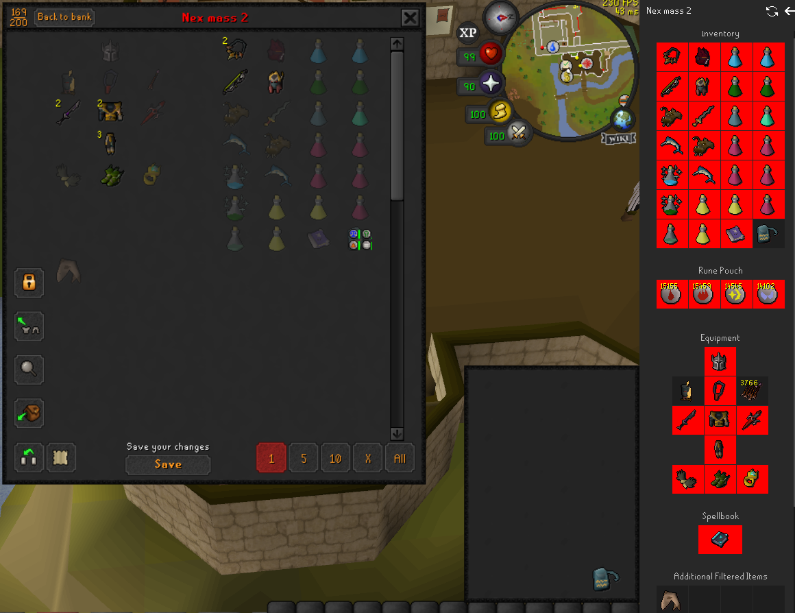

# GIMventory Setups

Filters and reorders the Group Ironman shared bank to match the setup currently active in [Inventory Setups](https://runelite.net/plugin-hub/show/inventory-setups).

Requires Inventory Setups to be installed and enabled - this plugin integrates with it entirely through its `PluginMessage` API, so it does nothing if Inventory Setups isn't present.

## What it does

- When you open a setup in Inventory Setups and open the shared bank, the plugin will hide unrelated items and the rest are reordered to roughly match the setup's layout.
- Live-updates as you switch setups or edit the active setup's contents while the shared bank stays open.
- Allows quick switching between filtered view and the full group storage using a hotkey set in the config.

## Limitations (v1)

- Matching is by exact item ID - setup items marked "fuzzy" in Inventory Setups only match their exact stored ID here, not their variant family.
- Customizing the layout is not possible at this stage, the view you see in the image above is the layout you will get.
- Minor visual glitches are possible, please report any issues to this repository unless it is affecting main bank/side panel as well.
- Please let me know what features are important to you and I will look into implementing them.
